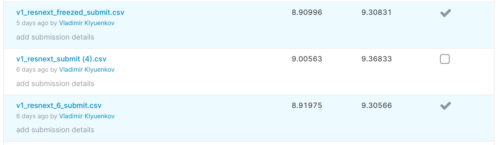

# Thousand_Facial_Landmarks_Detection


## How to get result

1. Lauch code `python hack_train.py --name "experiment_name" --data 'path_to_data' --gpu --epochs=2 --batch-size=64 -lr=0.005 --gamma=0.2` to get checkpoint `experiment_name_best.pth`.
2. To get submission run cell under `Create submission` in `train_in_colab_and_generate_submission.ipynb` with path to checkpoint and dataset.

## How was the model trained

1. Launched `train_in_colab_and_generate_submission.ipynb` to calculate mean and std for all pixels for 3 channels in image dataset, got `mean=[0.39963884, 0.31994772, 0.28253724], std=[0.33419772, 0.2864468, 0.26987])`
2. 6 epoch with `lr=0.001`, `gamma=1` to get `v1_resnext_best.pth`
3. 3 epoch with `lr=0.001`, `gamma=0.2` to get `v1_resnext_6_best.pth` and `v1_resnext_6_submit.csv`
4. 1 epoch with `lr=0.0001`, freezed feature extractor to get `v1_resnext_freezed_best.pth` and `v1_resnext_freezed_submit.csv`  

<details>
<summary>Freezed feature extractor</summary>
<br>
  
```python
    model = models.resnext101_32x8d(pretrained=True)
    
#   Uncomment for learning with freezed feature extractor
#   for param in model.parameters():
#     param.requires_grad = False

    model.fc = nn.Linear(model.fc.in_features, 2 * NUM_PTS, bias=True) 
```
</details>


## Submissions



## Some attempts

<details>
<summary> Wide_resnet101 + 2 FC layers + Dropout + input imagesize 224 </summary>
<br>
  
Creating model in `hack_train.py`:
```python
    model = models.wide_resnet101_2(pretrained=True)
     fc_layers = nn.Sequential(
                 nn.Linear(model.fc.in_features, 4 * NUM_PTS),
                 nn.ReLU(inplace=True),
                 nn.Dropout(p=0.1),
                 nn.Linear(4 * NUM_PTS,  2 * NUM_PTS),
                 nn.ReLU(inplace=True),
                 nn.Dropout(p=0.1))
     model.fc = fc_layers
```

In `hack_utils.py`:  

```python
CROP_SIZE = 224 
```

Unfortunately, the model did not have enough time to converge(

</details>
